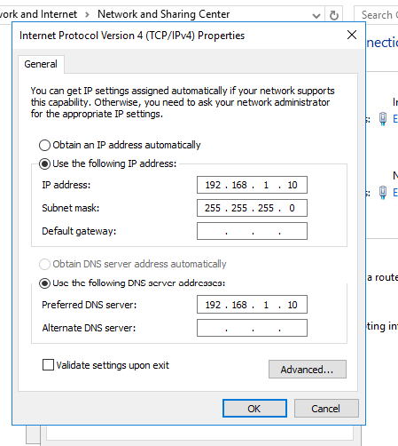
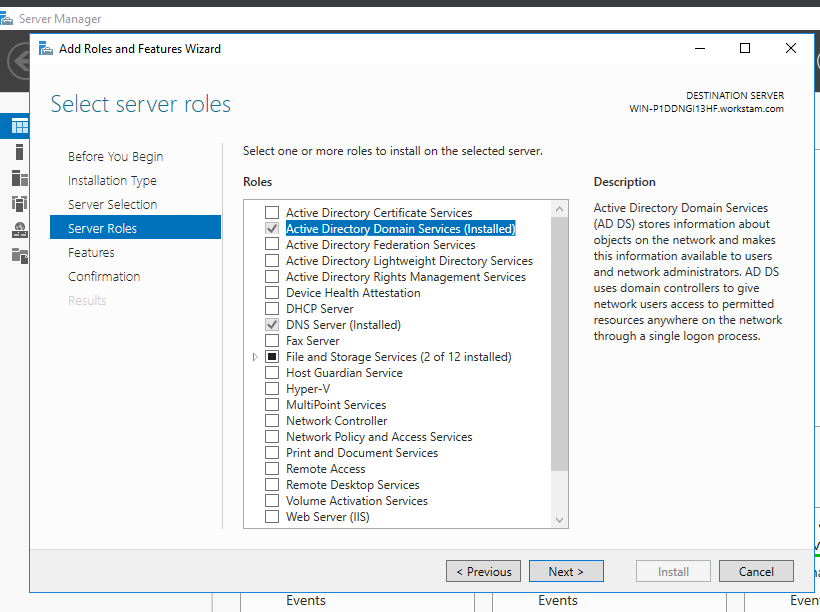
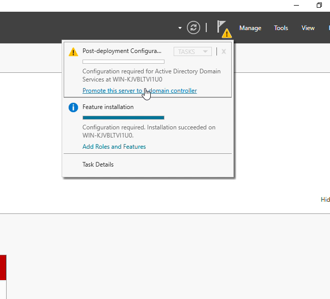
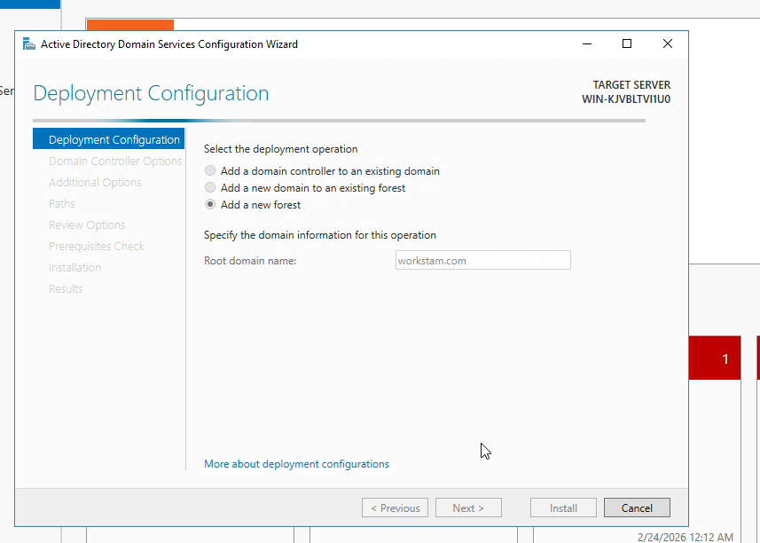
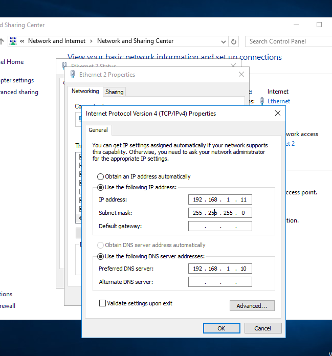
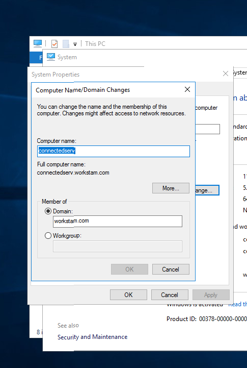
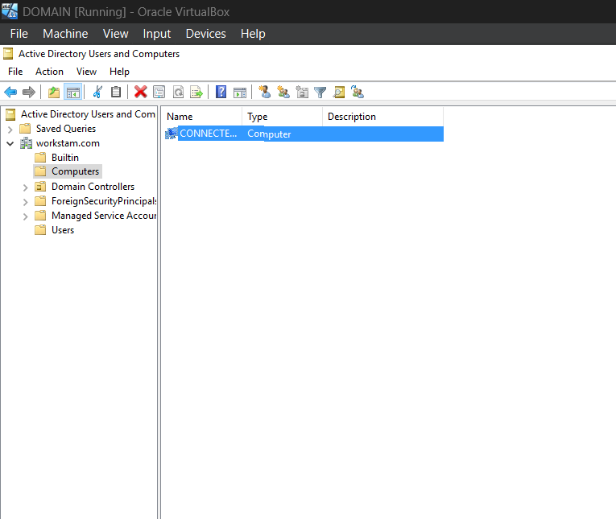
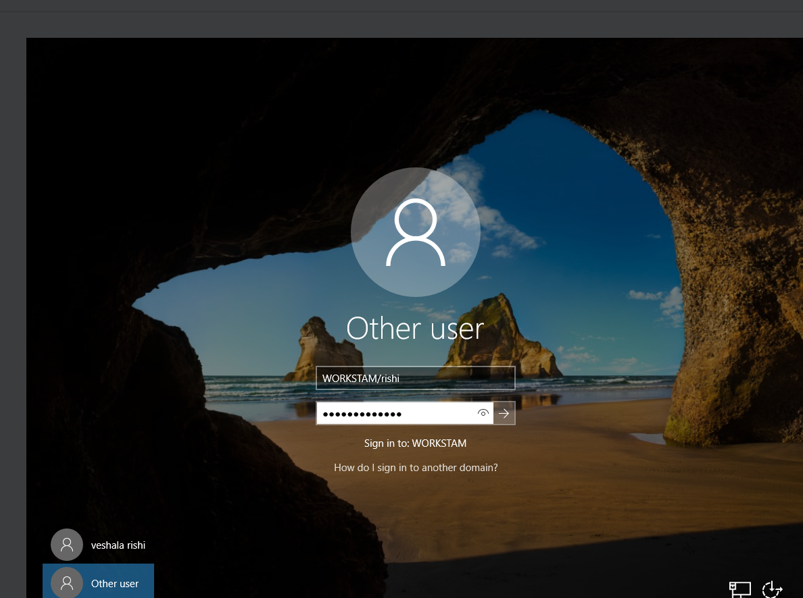
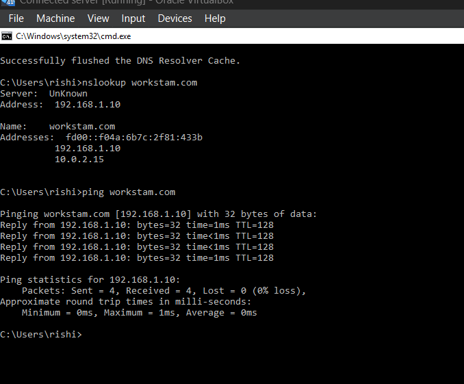
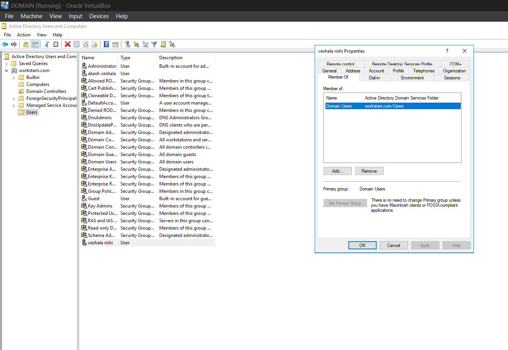

# Windows Server Domain Integration Lab

## Project Overview

In this lab, I set up an Active Directory environment using two Windows Servers in a virtual environment. 

The goal was to configure a Domain Controller, create a domain, and successfully join a member server to that domain while verifying DNS, authentication, and network connectivity.

---

## Lab Setup

- Windows Server 2019 / 2022
- VirtualBox (NAT + Internal Network)
- Domain Name: workstam.com
- Domain Controller IP: 192.168.1.10

---

# Domain Controller Configuration

### 1. Static IP Configuration
Configured a static IP address on the Domain Controller to ensure stable DNS and domain services.

### 2. Installed Active Directory Domain Services
Added the AD DS role from Server Manager.

### 3. Promoted Server to Domain Controller
Promoted the server and created a new forest for the domain.

### 4. Forest Creation
Created a new forest with the domain name `workstam.com`.

---

# Member Server Configuration

### 5. DNS Configuration
Configured the member server’s DNS settings to point to the Domain Controller IP.

### 6. Changed from Workgroup to Domain
Switched the system from a local workgroup to the domain environment.

### 7. Domain Join Confirmation
Successfully joined the member server to the domain.

### 8. Domain Login Verification
Logged in using domain credentials to confirm authentication.

### 9. Network Connectivity Test
Verified communication between servers using ping.

### 10. User Group Membership
Checked user group membership using the "Member Of" tab in Active Directory.

---

# Final Outcome

- Successfully deployed Active Directory Domain Services
- Created and configured a new domain
- Joined a member server to the domain
- Verified DNS resolution and authentication
- Confirmed proper network communication

This project helped strengthen my understanding of Active Directory, DNS configuration, domain management, and user/group administration in a Windows Server environment.
